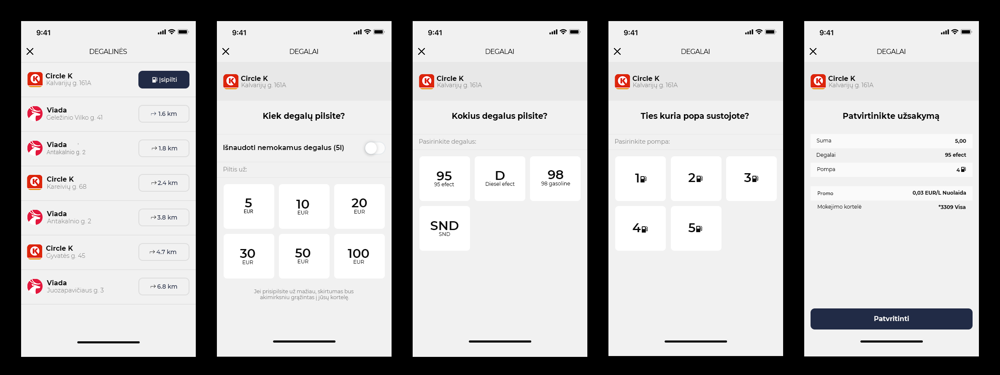

# Homework for React Native Candidate

Build car refuelling portion of an app. It should consist of a sequence of screens.

## Design

## Requirements

- [ ] Fetch fuel stations from https://run.mocky.io/v3/eaa9ca40-f091-434c-bb81-06f287d643cf
- [ ] Implement all provided screens. Just the general behavior is enough, don’t linger over the details. Tapping <kbd>Patvirtinti</kbd> on the final screen should just restart the sequence (return to the first screen)
- [ ] Share code as a private repo on GitHub. Add [@Cinamonas](https://github.com/Cinamonas) and [@artur-charcenko](https://github.com/artur-charcenko) as collaborators for review
- [ ] Include instructions on how to test the app in `README`. If TestFlight is used, send invites to _alex at carvertical dot com_ and _artur at carvertical dot com_

## Notes

- You can bootstrap the app however you want
- If you’re unsure on how some interaction should work, just use your best judgement
